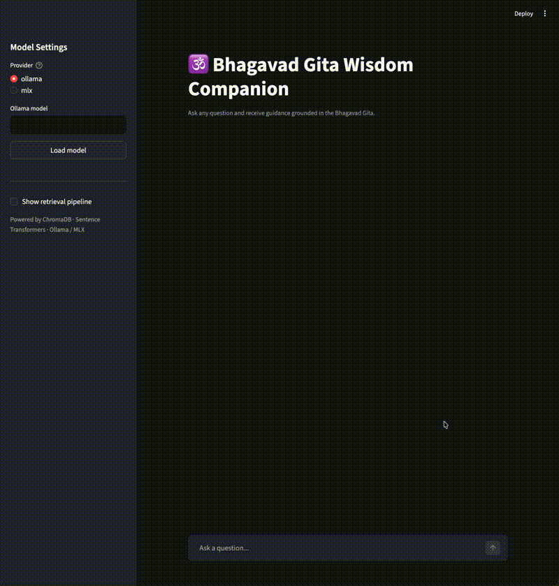

# Bhagavad Gita AI 🕉️

[](LICENSE)
[](https://www.python.org/downloads/)
[](https://ollama.com/)
[](https://www.trychroma.com/)
[](https://github.com/ml-explore/mlx)
[](https://github.com/akshayDhotre/slm_bhagwat_gita/stargazers)



A high-performance "Wisdom RAG" application that combines **Hierarchical Retrieval**, **Semantic Re-ranking**, and **Deep Commentary** to answer life's questions using the Bhagavad Gita.

Unlike standard RAG pipelines that only match similar words, this system mimics a knowledgeable teacher: first identifying the most relevant chapter theme, drilling down to specific verses within it, and catching cross-chapter wisdom through a global fallback — all ranked by embedding similarity.

## Latest Updates

### March 2026 — Live Retrieval Pipeline Visualization

The Streamlit UI now optionally shows a live step-by-step trace of every RAG operation before the response streams. Enable it with the **Show retrieval pipeline** checkbox in the sidebar.

Once enabled, each question triggers a transparent process view:

| Stage | What it shows |
| --- | --- |
| **Stage 1 — Chapter Discovery** | Which chapter summaries matched the query and their names |
| **Stage 2 — Candidate Pool** | Count of chapter-targeted verses + global cross-chapter supplement |
| **Stage 3 — Re-ranked Verses** | Top N verses ordered by embedding distance with score and text snippet |
| **Stage 4 — System Prompt** | Full prompt sent to the LLM (expandable) |

The pipeline trace stays visible after the response is generated and persists through the conversation so you can compare retrieval results across questions. Toggle it off to return to the clean chat interface.

Under the hood, `retrieve_hierarchical` in [src/rag.py](src/rag.py) was refactored into three independently callable stage methods — `query_chapters`, `query_slokas`, and `merge_and_rerank` — so the app can interleave UI updates between each real database call rather than showing a fake progress animation.

---

## Key Features

- **Hierarchical Retrieval**: "Forest & Trees" approach. First identifies the most relevant chapter themes, then searches for specific slokas within that context, supplemented by a global cross-chapter fallback.
- **Distance-Based Re-ranking**: Merges candidates from primary and global searches, deduplicates, then sorts by ChromaDB's embedding distance — no separate re-ranking model needed.
- **Commentary-Enriched**: Indexes deep philosophical Purports/Commentaries (Swami Sivananda, Prabhupada, etc.) alongside translations to capture abstract concepts.
- **Context-Aware Citations**: Answers are grounded with citations like `[Chapter 6: Dhyana Yoga, Verse 34]`.
- **Live Pipeline Transparency**: Optional sidebar toggle reveals the full retrieval trace — chapters matched, candidate counts, re-ranked verses with distance scores, and the exact system prompt — updating live as each stage completes.
- **Privacy-First**: Runs 100% locally using Ollama and ChromaDB.

## Architecture

1. **Ingestion with Enrichment**
   - Raw JSON data is processed to extract translations AND commentaries.
   - Chapter Summaries are stored as separate `type: "chapter_summary"` anchor documents.
   - ChromaDB metadata is strictly typed (`int`, `float`, `str`, `bool`) — no nested dicts or lists.

2. **Three-Stage Retrieval** (`src/rag.py: retrieve_hierarchical`)
   - *Stage 1*: Find top-N chapter summaries matching the query (broad theme search).
   - *Stage 2a*: Fetch sloka candidates filtered to the matched chapters (primary pool).
   - *Stage 2b*: Run a global sloka search across all chapters (cross-chapter fallback) and merge, deduplicating by `(chapter, verse)` — first-seen wins.
   - *Stage 3*: Sort the merged pool by ChromaDB embedding distance (ascending) and take the top-N.

3. **Generation**
   - Context is structured into two sections: relevant chapter summaries + relevant verses.
   - The LLM is instructed to answer in natural, contemporary language without quoting verse numbers or sounding like scripture — wisdom companion tone, not a commentary.

## Architecture Decision Log

This section records deliberate design choices, trade-offs considered, and known constraints.

---

### ADR-1: Single embedding model for indexing and re-ranking

**Decision:** Use `all-MiniLM-L6-v2` (via ChromaDB's `SentenceTransformerEmbeddingFunction`) as the only retrieval model. Re-ranking is done by sorting on ChromaDB's returned `distances` — no separate cross-encoder.

**Context:** The original design used a second model, `cross-encoder/ms-marco-MiniLM-L-6-v2`, to re-rank candidates. This required a separate model load and an inference call per candidate pair.

**Reasons for change:**

- The cross-encoder fired a HEAD request to `huggingface.co` on every load even when the model was locally cached, causing timeout warnings in offline/firewalled environments.
- MS-MARCO was trained on web-search passages — a different distribution from Vedic spiritual text.
- ChromaDB already returns cosine distances from the same embedding space as the index; sorting on those is logically equivalent without an extra model inference.
- The three-stage hierarchical retrieval (chapter filter → primary pool → global supplement) already reduces the candidate noise significantly.

**Trade-off:** Cross-encoders do joint query+document attention and are more precise in theory. For a focused, well-indexed domain like this one, bi-encoder similarity is sufficient.

---

### ADR-2: Hierarchical retrieval with global cross-chapter supplement

**Decision:** Run three ChromaDB queries per request — chapter summaries, chapter-filtered slokas, and an unconstrained global sloka search — then merge and de-duplicate.

**Context:** A plain flat sloka search misses cases where the most relevant teaching appears in a chapter not ranked in the top-N summaries.

**Reasons:**

- Chapter summary search provides coarse thematic routing (broad-to-narrow).
- The global supplement catches cross-chapter wisdom (e.g., a question about the mind might hit Chapter 6 primarily but also Chapter 3 and 13).
- Deduplication by `(chapter, verse)` ensures the primary pool's distances take precedence over any duplicates from the global search.

---

### ADR-3: ChromaDB as the local vector store

**Decision:** Use ChromaDB with a `PersistentClient` pointing at `data/chroma_db/`.

**Context:** Evaluated in-memory solutions and hosted alternatives.

**Reasons:**

- Fully local — no network dependency, no API keys.
- `SentenceTransformerEmbeddingFunction` handles embedding at query time automatically.
- Supports filtered queries via `where` clauses (essential for the chapter-filter stage).
- ChromaDB metadata values must be primitive types (`int`, `float`, `str`, `bool`). Nested dicts or lists are not supported — data ingestion normalises all metadata to flat primitives.

---

### ADR-4: MLX as a second inference backend

**Decision:** Support both Ollama and MLX (`mlx-lm`) as generation backends, selected via `model_provider` at runtime.

**Context:** The project includes a fine-tuned Llama model specifically adapted on Bhagavad Gita Q&A data.

**Reasons:**

- MLX runs natively on Apple Silicon, enabling fast local inference from the fine-tuned model without Ollama.
- MLX imports are deferred and guarded with `try/except` — if `mlx-lm` is not installed, the Ollama path works normally.
- `stream_generate` is also guarded (only available in newer `mlx-lm` versions); older versions fall back to full `generate` emitted as one chunk.

---

### ADR-5: RAGAS evaluation with Ollama as the judge LLM

**Decision:** Use Ollama's OpenAI-compatible `/v1` endpoint with RAGAS's `llm_factory` for the judge LLM. Use `sentence-transformers` locally for the `AnswerRelevancy` embedding scorer.

**Context:** RAGAS 0.4 dropped `LangchainLLMWrapper`. Ollama chat models (e.g., `gemma3`, `deepseek-r1`) do not support the Ollama `/api/embeddings` endpoint — they return HTTP 501.

**Reasons:**

- `llm_factory(model=..., client=ollama_client)` works with any OpenAI-compatible endpoint. No real API key is needed; Ollama ignores the value.
- RAGAS's `HuggingFaceEmbeddings` uses `sentence-transformers` locally, avoiding the Ollama embedding limitation entirely.
- Setting `TRANSFORMERS_OFFLINE=1` and `HF_DATASETS_OFFLINE=1` prevents HuggingFace network calls when the model is already cached.

---

### ADR-6: External eval config support (Crucible format)

**Decision:** `notebooks/ragas_eval.ipynb` can load evaluation questions from an external JSON file instead of the hardcoded built-in set.

**Format:**

```json
{
  "question":     ["q1", "q2"],
  "ground_truth": ["expected answer 1", ""],
  "answer":       ["", ""],
  "contexts":     [[], []]
}
```

**Reasons:**

- Allows reuse of test configs generated by external tools (e.g., Crucible agent test-config app) without reformatting.
- Empty `answer` / `contexts` arrays signal the notebook to run the RAG pipeline and fill them in. Pre-filled values skip the RAG step and are scored directly.
- `ground_truth` maps to RAGAS's `reference` field (used for Context Recall).

---

### ADR-7: Prompt design — wisdom companion, not scripture reader

**Decision:** The system prompt explicitly forbids the LLM from quoting verse numbers, mentioning chapter references, or sounding like a commentary. It must answer as "a fellow human sharing lived understanding."

**Reasons:**

- The target use case is someone seeking personal guidance, not academic citation.
- Verse citations are provided separately via the structured `Sources` block — the answer itself should feel conversational.
- If the context does not directly address the question, the LLM is instructed to say so honestly, then offer a related insight from the Gita's broader themes rather than hallucinating specific teachings.

## 🛠️ Setup

### Prerequisites

- Python 3.12+
- [uv](https://github.com/astral-sh/uv) (Recommended) or pip
- [Ollama](https://ollama.com/)

### 1. Installation

Clone the repo and install dependencies:

```bash
uv sync
# OR (standard pip)
pip install .
```

### 2. Model Setup

Pull the reasoning model used by the system:

```bash
ollama pull deepseek-r1:8b
```

> [!TIP]
> **Custom Models**: You can use any suitable model from [Ollama](https://ollama.com/library).
> To use a different model (e.g., `llama3.1`, `mistral`), verify it is pulled (`ollama pull <model_name>`) and update the `model` variable in `src/config.py`.

### 3. Build Knowledge Base

Download the dataset and build the enriched vector database:

```bash
uv run src/data_ingestion.py
uv run src/ingest.py
```

*(This will process ~740 documents including Chapters and Slokas)*

## 🏃‍♂️ Usage

### Web UI (Streamlit)

Start the web interface:

```bash
uv run streamlit run app.py
```

The UI streams the response token-by-token and shows the cited verses in a collapsible **Sources** panel below the chat. Use the sidebar to switch between Ollama and MLX providers.

### CLI

Start the interactive terminal session:

```bash
uv run main.py
```

**Example Interaction:**

```text
You: Why am I always distracted?

Wisdom Bot: Staying focused is difficult because the mind by nature is restless...

--- Sources ---
Chapter 6: Dhyana Yoga, Verse 35
Chapter 6: Dhyana Yoga, Verse 26
---------------
```

## 📂 Structure

- `src/data_ingestion.py`: Downloads the **RAG knowledge base** from HuggingFace (`XenArcAI/Bhagwat-Gita-Infinity`), extracts translations and commentaries, and writes `data/processed/gita_knowledge_base.jsonl`.
- `src/download_data.py`: Downloads the **fine-tuning Q&A dataset** (`JDhruv14/Bhagavad-Gita-QA`) to `data/bhagavad_gita.csv`. Only needed if you are training or evaluating a custom model — not required for the RAG chatbot.
- `src/ingest.py`: Reads `gita_knowledge_base.jsonl` and builds the ChromaDB vector index.
- `src/rag.py`: Core engine — hierarchical search and distance-based ranking.
- `src/config.py`: Central configuration — all model names, paths, and retrieval parameters.
- `main.py`: Interactive CLI entry point (streaming output).
- `data/`: Stores the local vector database and processed datasets.
- `notebooks/`: All Jupyter notebooks.
  - `ragas_eval.ipynb`: RAGAS evaluation with Crucible JSON import support.
  - `fine_tune_llama_mlx.ipynb`: Fine-tuning on Apple Silicon via MLX.
  - `fine_tune_llama_unsloth.ipynb`: Fine-tuning via Unsloth (GPU/Colab).
  - `hf_dataset_work.ipynb`: Dataset preparation and exploration. Run `src/download_data.py` first to get the training data.

## 🔭 Future Improvements

### Retrieval

- **Domain-specific embedding model** — `all-MiniLM-L6-v2` is a general-purpose model. Fine-tuning an embedding model on Gita Q&A pairs (using the `JDhruv14` dataset) would improve semantic matching for Sanskrit-derived concepts and Vedic vocabulary that general embeddings struggle with.
- **Cross-encoder re-ranking** — re-introduce a cross-encoder (e.g., `cross-encoder/ms-marco-MiniLM-L-6-v2`) as an optional post-retrieval step, guarded behind a config flag. The joint query+document attention of a cross-encoder is more precise than bi-encoder cosine distance, especially for nuanced questions.
- **Multi-translation indexing** — currently one author's translation is indexed per sloka. Indexing multiple translations per verse (e.g., Sivananda + Prabhupada + Gambhirananda) and pooling their embeddings would broaden semantic coverage.

### Generation

- **Conversation memory** — the current pipeline is stateless (each question is answered independently). Adding a short conversation buffer would allow follow-up questions like "Tell me more about that" to be resolved correctly.
- **Configurable generation parameters** — expose `temperature`, `top_p`, and `max_tokens` in `src/config.py` and the Streamlit sidebar, rather than relying on the model's defaults.
- **Structured output** — use a JSON-mode or tool-call response format to get the answer and a confidence signal back separately, making it easier to decide when to show "I'm not sure" messaging.

### Evaluation

- **Automated regression suite** — run the RAGAS evaluation notebook (`notebooks/ragas_eval.ipynb`) on a fixed golden question set as part of CI, tracking Context Recall, Faithfulness, and Answer Relevancy over time to detect retrieval or prompt regressions.
- **Retrieval-only unit tests** — add pytest fixtures that assert specific well-known slokas (e.g., BG 2.47 for karma yoga questions) are always retrieved within the top-N results.

### Infrastructure

- **Docker image** — package the app (ChromaDB index + Streamlit UI) into a container so it runs without any local Python or Ollama setup, using Ollama as a sidecar service.
- **Incremental ingestion** — the current `src/ingest.py` drops and rebuilds the entire collection on every run. A hash-based diff approach would allow adding new commentaries or translations without a full re-index.

## 🙏 Acknowledgments & Credits

Special thanks to the authors of the following Hugging Face datasets used in this project:

### Datasets

- [Parveshiiii/Bhagwat-Gita-Infinity](https://huggingface.co/datasets/Parveshiiii/Bhagwat-Gita-Infinity) — Parvesh Rawal, Modotte (2025)
- [JDhruv14/Bhagavad-Gita-QA](https://huggingface.co/datasets/JDhruv14/Bhagavad-Gita-QA) — Dhruv Jaradi (2025)

### Citations

```bibtex
@dataset{rawal2025bhagwatgitainfinity,
  title     = {Bhagwat-Gita-Infinity},
  author    = {Parvesh Rawal},
  year      = {2025},
  publisher = {Modotte},
  url       = {https://huggingface.co/datasets/Parveshiiii/Bhagwat-Gita-Infinity}
}

@dataset{JDhruv14-Bhagavad-Gita-QA,
  title     = {Bhagavad-Gita-QA},
  author    = {Dhruv Jaradi},
  year      = {2025},
  url       = {https://huggingface.co/datasets/JDhruv14/Bhagavad-Gita-QA}
}
```
